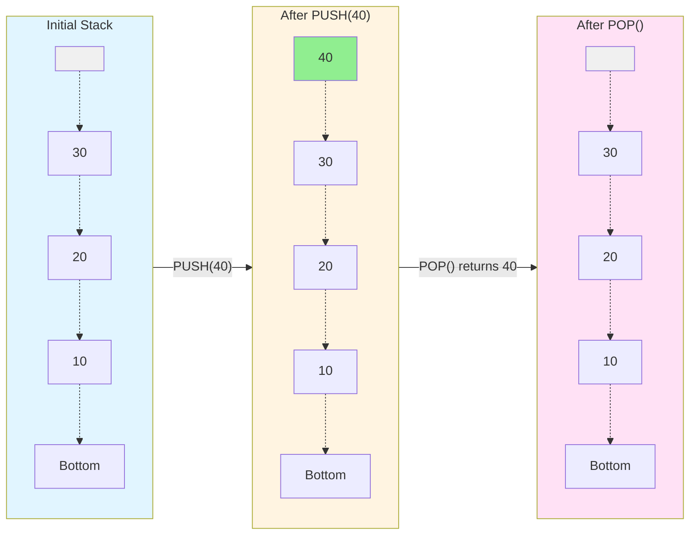
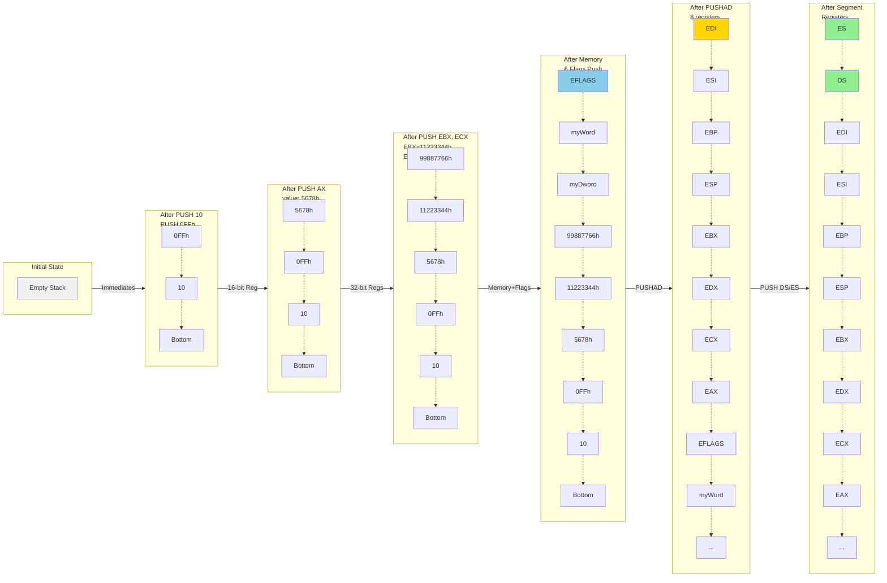
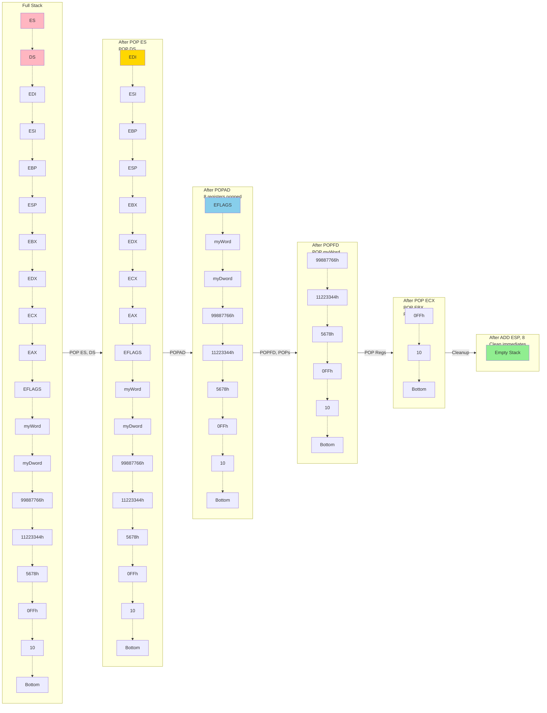

The stack is a memory part of every program in every language. In assembly we explicitly allocate memory for it at the start by doing:
```cpp
.stack 4096
```

using this we have allocated 4096 bytes of memory to be used as the stack of the program. Stack is a data structure that works on the principle of Last in First out (LIFO).



## Concept and Walkthrough
```cpp
; MASM Program - Comprehensive Stack Operations Demo
; Demonstrates all types of data that can be pushed to the stack

.386
.model flat, stdcall
.stack 4096

.data
    myByte      BYTE 42h           ; Byte value
    myWord      WORD 1234h         ; Word value
    myDword     DWORD 12345678h    ; Double word value
    memValue    DWORD 0ABCDh       ; Memory variable
    
.code
main PROC
    ; 1. Push immediate values (constants)
    PUSH 10                        ; Push immediate decimal
    PUSH 0FFh                      ; Push immediate hex
    
    ; 2. Push 16-bit registers
    MOV AX, 5678h
    PUSH AX                        ; Push 16-bit register
    
    ; 3. Push 32-bit registers
    MOV EBX, 11223344h
    PUSH EBX                       ; Push 32-bit register
    
    MOV ECX, 99887766h
    PUSH ECX                       ; Push another 32-bit register
    
    ; 4. Push memory operands
    PUSH myDword                   ; Push DWORD from memory
    PUSH myWord                    ; Push WORD from memory
    
    ; 5. Push EFLAGS register
    PUSHFD                         ; Push 32-bit flags register
    
    ; 6. Push all general purpose registers
    PUSHAD                         ; Push EAX, ECX, EDX, EBX, ESP, EBP, ESI, EDI
    
    ; 7. Push segment registers (16-bit)
    PUSH DS                        ; Push data segment
    PUSH ES                        ; Push extra segment
    
    ; Now pop everything back in reverse order
    POP ES
    POP DS
    POPAD                          ; Pop all general purpose registers
    POPFD                          ; Pop flags
    POP myWord
    POP myDword
    POP ECX
    POP EBX
    POP AX
    ADD ESP, 8                     ; Clean up the two immediate values
    
    ; Exit program
    MOV EAX, 0
    RET
main ENDP

END main
```

### Summary
1. Immediate values (8, 16, 32-bit constants)
2. General purpose registers (AX, EAX, EBX, ECX, EDX, ESI, EDI, EBP)
3. Memory operands (BYTE, WORD, DWORD variables)
4. Flags register (PUSHF/PUSHFD for 16/32-bit)
5. All registers at once (PUSHA/PUSHAD for 16/32-bit)
6. Segment registers (CS, DS, ES, SS, FS, GS)

NOTES:
- PUSH always uses word or doubleword operands (2 or 4 bytes)
- Stack grows downward (toward lower memory addresses)
- ESP register automatically decrements with each PUSH
- PUSH of immediate byte values are sign-extended to word/dword

#### Diagram


### POP Walkthrough


### Push in procedure calling
```cpp
; MASM Program - Function Argument Order Demo
; Function: Subtract(minuend, subtrahend) = minuend - subtrahend
; This demonstrates why argument order matters!

.386
.model flat, stdcall
.stack 4096

.data
    result1 DWORD ?
    result2 DWORD ?
    
.code

; Function: Subtract two numbers
; Parameters: minuend (first), subtrahend (second)
; Returns: minuend - subtrahend in EAX
; Formula: Subtract(10, 3) = 10 - 3 = 7
Subtract PROC
    PUSH EBP                    ; Save base pointer
    MOV EBP, ESP                ; Set up stack frame
    
    ; Stack layout at this point:
    ; [EBP+12] = first parameter (minuend)
    ; [EBP+8]  = second parameter (subtrahend)
    ; [EBP+4]  = return address
    ; [EBP]    = saved EBP
    
    MOV EAX, [EBP+12]          ; Get first parameter (minuend)
    SUB EAX, [EBP+8]           ; Subtract second parameter (subtrahend)
    
    POP EBP                     ; Restore base pointer
    RET 8                       ; Return and clean 8 bytes (2 parameters)
Subtract ENDP

main PROC
    ; ==========================================
    ; CORRECT ORDER: Subtract(10, 3) = 10 - 3 = 7
    ; ==========================================
    PUSH 3                      ; Push subtrahend (second parameter)
    PUSH 10                     ; Push minuend (first parameter)
    CALL Subtract               ; Result in EAX = 7
    MOV result1, EAX            ; Store result (should be 7)
    
    ; ==========================================
    ; WRONG ORDER: Arguments swapped!
    ; We want Subtract(10, 3) but push in wrong order
    ; This gives us Subtract(3, 10) = 3 - 10 = -7
    ; ==========================================
    PUSH 10                     ; Push minuend (WRONG - should be second!)
    PUSH 3                      ; Push subtrahend (WRONG - should be first!)
    CALL Subtract               ; Result in EAX = -7 (WRONG!)
    MOV result2, EAX            ; Store result (will be -7, not 7!)
    
    ; Exit program
    MOV EAX, 0
    RET
main ENDP

END main```
```
EXPLANATION:
; ============
; result1 = 7  (CORRECT: 10 - 3)
; result2 = -7 (WRONG: 3 - 10)
;
; The function expects:
;   [EBP+12] = minuend (number to subtract FROM)
;   [EBP+8]  = subtrahend (number to subtract)
;
; Parameters are pushed RIGHT-TO-LEFT (stdcall convention)
; So for Subtract(10, 3):
;   1. PUSH 3  (second parameter - subtrahend)
;   2. PUSH 10 (first parameter - minuend)
;   3. CALL Subtract
;
; The last pushed value (10) is accessed first as [EBP+12]
; The first pushed value (3) is accessed second as [EBP+8]