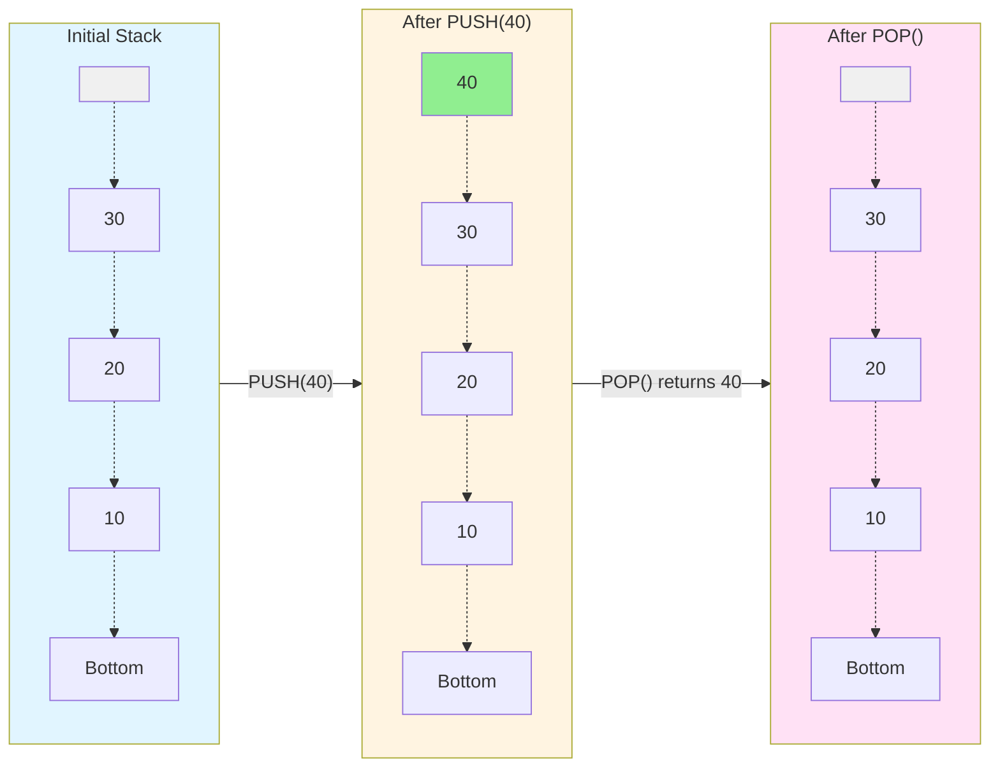
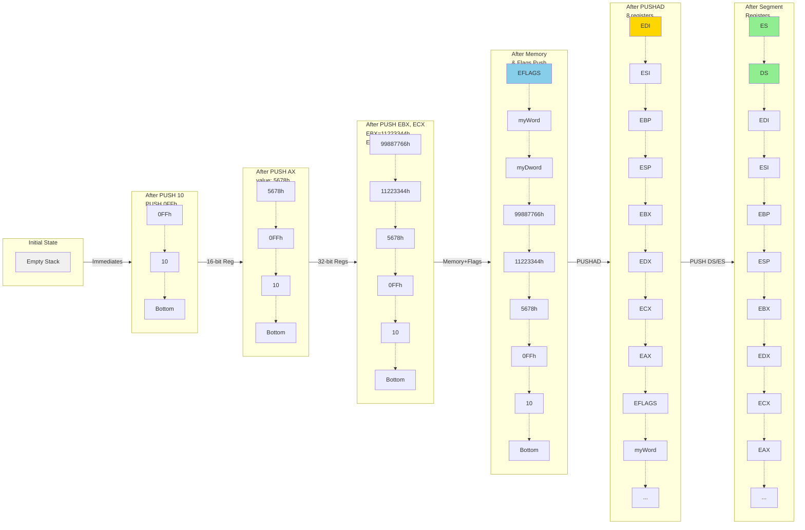
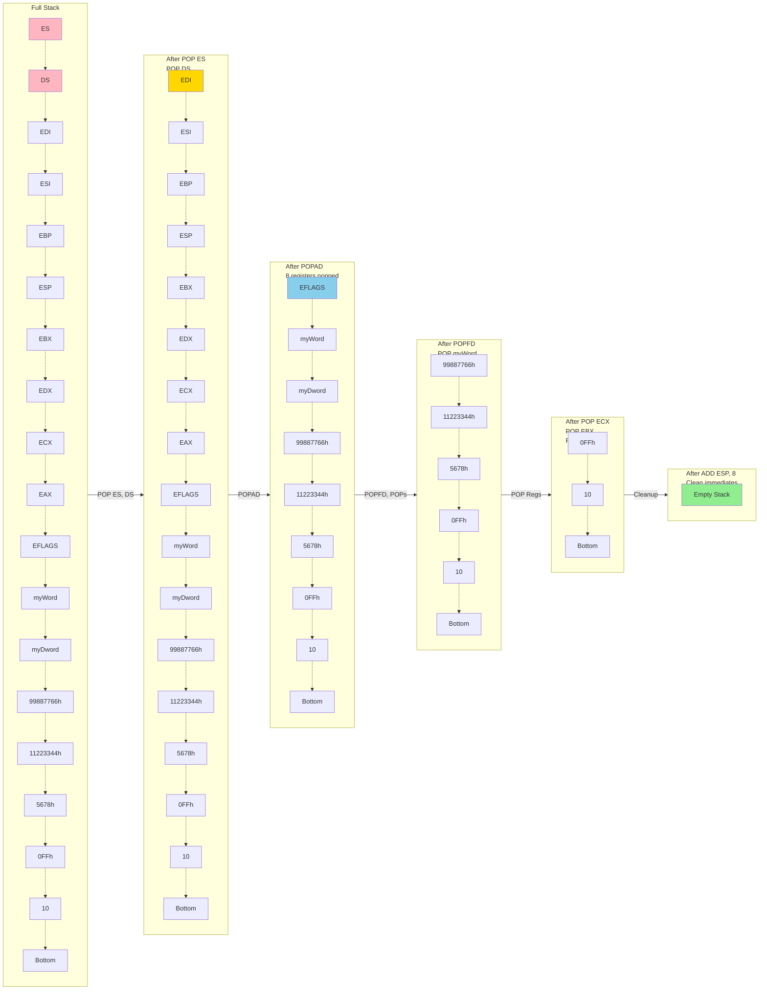
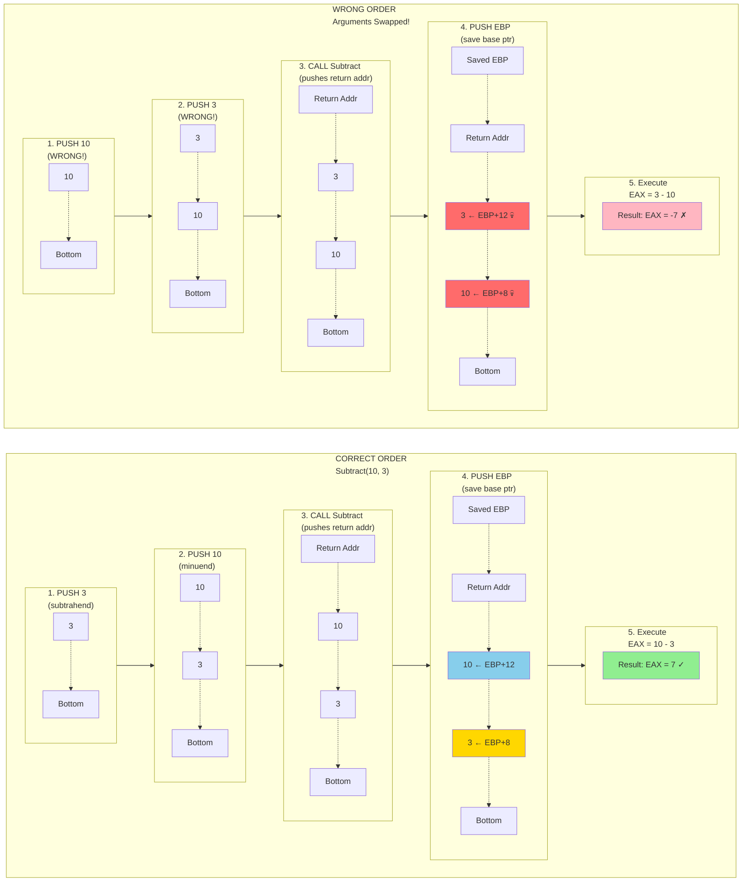

The stack is a memory part of every program in every language. In assembly we explicitly allocate memory for it at the start by doing:
```cpp
.stack 4096
```

using this we have allocated 4096 bytes of memory to be used as the stack of the program. Stack is a data structure that works on the principle of Last in First out (LIFO).



## Concept and Walkthrough
```cpp
; MASM Program - Comprehensive Stack Operations Demo
; Demonstrates all types of data that can be pushed to the stack

.386
.model flat, stdcall
.stack 4096

.data
    myByte      BYTE 42h           ; Byte value
    myWord      WORD 1234h         ; Word value
    myDword     DWORD 12345678h    ; Double word value
    memValue    DWORD 0ABCDh       ; Memory variable
    
.code
main PROC
    ; 1. Push immediate values (constants)
    PUSH 10                        ; Push immediate decimal
    PUSH 0FFh                      ; Push immediate hex
    
    ; 2. Push 16-bit registers
    MOV AX, 5678h
    PUSH AX                        ; Push 16-bit register
    
    ; 3. Push 32-bit registers
    MOV EBX, 11223344h
    PUSH EBX                       ; Push 32-bit register
    
    MOV ECX, 99887766h
    PUSH ECX                       ; Push another 32-bit register
    
    ; 4. Push memory operands
    PUSH myDword                   ; Push DWORD from memory
    PUSH myWord                    ; Push WORD from memory
    
    ; 5. Push EFLAGS register
    PUSHFD                         ; Push 32-bit flags register
    
    ; 6. Push all general purpose registers
    PUSHAD                         ; Push EAX, ECX, EDX, EBX, ESP, EBP, ESI, EDI
    
    ; 7. Push segment registers (16-bit)
    PUSH DS                        ; Push data segment
    PUSH ES                        ; Push extra segment
    
    ; Now pop everything back in reverse order
    POP ES
    POP DS
    POPAD                          ; Pop all general purpose registers
    POPFD                          ; Pop flags
    POP myWord
    POP myDword
    POP ECX
    POP EBX
    POP AX
    ADD ESP, 8                     ; Clean up the two immediate values
    
    ; Exit program
    MOV EAX, 0
    RET
main ENDP

END main
```

### Summary
1. Immediate values (8, 16, 32-bit constants)
2. General purpose registers (AX, EAX, EBX, ECX, EDX, ESI, EDI, EBP)
3. Memory operands (BYTE, WORD, DWORD variables)
4. Flags register (PUSHF/PUSHFD for 16/32-bit)
5. All registers at once (PUSHA/PUSHAD for 16/32-bit)
6. Segment registers (CS, DS, ES, SS, FS, GS)

NOTES:
- PUSH always uses word or doubleword operands (2 or 4 bytes)
- Stack grows downward (toward lower memory addresses)
- ESP register automatically decrements with each PUSH
- PUSH of immediate byte values are sign-extended to word/dword

#### Diagram


### POP Walkthrough


### Push in procedure calling
```cpp
; MASM Program - Function Argument Order Demo
; Function: Subtract(minuend, subtrahend) = minuend - subtrahend
; This demonstrates why argument order matters!

.386
.model flat, stdcall
.stack 4096

.data
    result1 DWORD ?
    result2 DWORD ?
    
.code

; Function: Subtract two numbers
; Parameters: minuend (first), subtrahend (second)
; Returns: minuend - subtrahend in EAX
; Formula: Subtract(10, 3) = 10 - 3 = 7
Subtract PROC
    PUSH EBP                    ; Save base pointer
    MOV EBP, ESP                ; Set up stack frame
    
    ; Stack layout at this point:
    ; [EBP+12] = first parameter (minuend)
    ; [EBP+8]  = second parameter (subtrahend)
    ; [EBP+4]  = return address
    ; [EBP]    = saved EBP
    
    MOV EAX, [EBP+12]          ; Get first parameter (minuend)
    SUB EAX, [EBP+8]           ; Subtract second parameter (subtrahend)
    
    POP EBP                     ; Restore base pointer
    RET 8                       ; Return and clean 8 bytes (2 parameters)
Subtract ENDP

main PROC
    ; ==========================================
    ; CORRECT ORDER: Subtract(10, 3) = 10 - 3 = 7
    ; ==========================================
    PUSH 3                      ; Push subtrahend (second parameter)
    PUSH 10                     ; Push minuend (first parameter)
    CALL Subtract               ; Result in EAX = 7
    MOV result1, EAX            ; Store result (should be 7)
    
    ; ==========================================
    ; WRONG ORDER: Arguments swapped!
    ; We want Subtract(10, 3) but push in wrong order
    ; This gives us Subtract(3, 10) = 3 - 10 = -7
    ; ==========================================
    PUSH 10                     ; Push minuend (WRONG - should be second!)
    PUSH 3                      ; Push subtrahend (WRONG - should be first!)
    CALL Subtract               ; Result in EAX = -7 (WRONG!)
    MOV result2, EAX            ; Store result (will be -7, not 7!)
    
    ; Exit program
    MOV EAX, 0
    RET
main ENDP

END main
```

EXPLANATION:
result1 = 7  (CORRECT: 10 - 3)
result2 = -7 (WRONG: 3 - 10)

The function expects:
- [EBP+12] = minuend (number to subtract FROM)
- [EBP+8]  = subtrahend (number to subtract)

Parameters are pushed RIGHT-TO-LEFT (stdcall convention)
So for Subtract(10, 3):
1. PUSH 3  (second parameter - subtrahend)
2. PUSH 10 (first parameter - minuend)
3. CALL Subtract

The last pushed value (10) is accessed first as [EBP+12]
The first pushed value (3) is accessed second as [EBP+8]




# The Mechanics of `CALL` and `RET`

**⚠️ CRITICAL:** This is the number one area where students lose marks. You must understand how the Instruction Pointer (EIP) interacts with the stack.

---

## How `CALL` Actually Works

When you write `CALL MyProc`:

1. The CPU calculates the address of the instruction immediately following the CALL (the **Return Address**)
2. It **PUSHES** that Return Address onto the stack
3. It copies the address of `MyProc` into `EIP` (Instruction Pointer)
4. The CPU executes instructions at `EIP`

---

## How `RET` Actually Works

When the CPU hits `RET`:

1. It **POPS** the value from the top of the stack
2. It copies that value into `EIP`
3. Execution resumes at that address

### 🧠 Mind-Bending Implication

If you `PUSH` a random value onto the stack and then execute `RET`, the CPU will try to "return" to that random address, causing a crash (**Segmentation Fault**).

---

## The `USES` Operator

Instead of manually typing `push ebx` / `pop ebx`, MASM provides the `USES` operator to automate this in the procedure definition.

### Syntax

```asm
MyProcedure PROC USES eax ebx ecx
    mov eax, 10
    mov ebx, 20
    mov ecx, 30
    ret
MyProcedure ENDP
```

### What MASM Generates Behind the Scenes

```asm
push eax
push ebx
push ecx
; ... your code ...
pop ecx
pop ebx
pop eax
ret
```

**⚠️ Note:** The reverse order of popping!

---

## Mind-Bending Scenarios (Edge Cases)

### Scenario A: The Stack Corruption (The "Mismatched Push")

```asm
MyProc PROC
    push eax        ; Save EAX
    mov eax, 10
    ; Forgot to pop EAX!
    ret             ; RET pops the top of stack... which is EAX!
MyProc ENDP
```

**Result:** 🔴 **CRITICAL FAILURE**

The `RET` instruction blindly pops the top value. It thinks the old EAX value is the Return Address. It jumps to `EAX` (value 10 or whatever was in it). The program crashes because it's executing garbage memory.

---

### Scenario B: Manual Jumps Using RET

**Concept:** You can use `RET` to jump to a specific label without using `JMP`.

```asm
    push OFFSET TargetLabel  ; Push address of label
    ret                      ; "Returns" to TargetLabel
TargetLabel:
    ; Code continues here
```

**Why use this?** Obfuscation or writing exploit shellcode.

---

### Scenario C: Nested Calls and Stack Growth

If Proc A calls Proc B, and Proc B calls Proc C:

- Stack contains: `[Ret Addr for A]` → `[Ret Addr for B]` → `[Ret Addr for C]`
- As functions return, the stack "unwinds"

---

### Scenario D: Stack Overflow (Infinite Recursion)

```asm
RecursiveProc PROC
    call RecursiveProc   ; Calls itself forever
    ret
RecursiveProc ENDP
```

**Result:**

1. Pushes Return Address
2. Decrements ESP
3. Repeats until ESP hits the bottom of the reserved stack memory
4. **Stack Overflow Exception**

---

## MCQ Trap Zone

Concepts likely to trick you in multiple-choice questions.

### Question 1: Does `PUSH` increase or decrease memory addresses?

**Answer:** **Decrease**. The stack grows downward (from high memory to low memory). Pushing subtracts 4 from ESP.

---

### Question 2: If `ESP = 00001000h` and you execute `PUSH EAX`, what is `ESP`?

**Answer:** `00000FFCh` (1000h - 4 = FFCh)

---

### Question 3: What happens if you define a procedure without `RET`?

**Answer:** The CPU performs **"fall-through."** It continues executing whatever bytes are in memory after the procedure, likely causing a crash or executing the next procedure immediately.

---

### Question 4: Can you pass parameters using the stack?

**Answer:** **Yes!** You `PUSH` arguments before the `CALL`. (This is standard in C/C++, though Chapter 5 mostly focuses on register parameters)

---

### Question 5: What is the difference between `RET` and `RET n` (e.g., `RET 8`)?

**Answer:**

- `RET` just pops EIP
- `RET n` pops EIP **AND** adds `n` to ESP

This is used to "clean up" arguments pushed onto the stack (**StdCall convention**).

---

## Quick Reference: Stack Behavior

|Instruction|Effect on ESP|Effect on Stack|
|---|---|---|
|`PUSH EAX`|ESP = ESP - 4|Stores EAX at [ESP]|
|`POP EAX`|ESP = ESP + 4|Loads EAX from [ESP]|
|`CALL MyProc`|ESP = ESP - 4|Pushes Return Address|
|`RET`|ESP = ESP + 4|Pops into EIP|
|`RET 8`|ESP = ESP + 12|Pops EIP, then ESP += 8|

---

## Key Takeaways

✅ **Always match PUSH/POP pairs** - Unbalanced stack = crash  
✅ **CALL = PUSH return address + JMP**  
✅ **RET = POP into EIP**  
✅ **Stack grows downward** (high → low memory)  
✅ **USES operator auto-generates PUSH/POP** (in reverse order)  
✅ **No RET = fall-through execution** (dangerous!)

---

_Study this guide thoroughly - stack mechanics are fundamental to understanding assembly procedures and are a common source of exam questions._