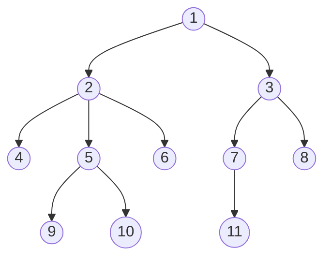
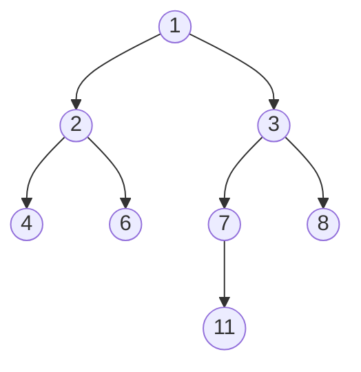

## Terms
- #### Node
- #### Link
- #### Root
- #### Parent
- #### Child
- #### Internal Nodes
- #### Leaf Nodes
- #### Depth
- #### Height

## What is a Tree?
A tree is a data structure that stores its elements, in Nodes, in a hierarchal structure. The nodes are connected together in relations like, parent <--> child, or siblings, ancestors, or cousins etc. In the example tree shown above, the elements numbered 1, 2, 3... are nodes. Each node holds some data, which in this case are integers, but can be strings, doubles or any thing else. A node also holds the pointer to the next nodes, which are the child nodes. This is similar to a Linked list, but is subject to a few constraints that differentiates Linked Lists from trees. Nodes of trees only point in one direction i.e. parent --> child.	Also, there cannot be a circular linkage in trees (nodes cannot point back to their ancestors). Finally, each node can have at max 1 parent. 

## Node: 
A node is a class (or a struct) that makes up a tree. It holds data, and holds the addresses of the child nodes. For the tree provided above, a node class may look something like this: 
```cpp

class Node {
	int data;
	Node* left;
	Node* middle;
	Node* right;

	// Actual implementation will have constructors and a few other functions as well.
};
```

- ### Root Node:
    
    This is the first node from the top in a tree. A root node has no parent node. In the above example, 1 is the root node. It has two child nodes 2 and 3.
    
- #### Relational Hierarchy
    

In a tree data structure, the relationships between nodes are defined by a strict hierarchy. Each node, except for the root, has exactly one parent. A parent node can have one or more child nodes. Nodes that share the same parent are called siblings. The lineage of a node can be traced upwards to its ancestors (parents, grandparents, etc.) and downwards to its descendants (children, grandchildren, etc.). This hierarchical structure ensures that there are no cycles in the tree, meaning a node cannot be its own ancestor or descendant, and there is a unique path from the root to any other node.

- #### Internal Nodes
    

Internal nodes are nodes that have at least one child. They are not leaf nodes and are part of the tree\'s internal structure, branching out to other nodes. In the example tree, nodes 1, 2, 3, and 7 are internal nodes.

- #### Leaf Nodes
    

Leaf nodes, also known as external nodes, are nodes that do not have any children. They represent the end points of the tree\'s branches. In the example tree, nodes 4, 6, 8, and 11 are leaf nodes.

- #### Depth of Nodes
    

The depth of a node is the length of the path from the root to that node. The root node is at depth 0. The depth of any other node is its parent\'s depth plus one. For example, in the given tree:

- Depth of node 1 (root) is 0.
    
- Depth of nodes 2 and 3 is 1.
    
- Depth of nodes 4, 6, 7, and 8 is 2.
    
- Depth of node 11 is 3.
    
- #### Height of a Node
    

The height of a node is the length of the longest path from that node to a leaf node in its subtree. The height of a leaf node is 0. For example, in the given tree:

- Height of node 11 is 0.
    
- Height of node 7 is 1 (path to 11).
    
- Height of node 2 is 1 (paths to 4 or 6).
    
- Height of node 1 is 3 (path to 3, then 7, then 11).
    
- #### Height of a Tree
    

The height of a tree is the height of its root node. It is the length of the longest path from the root to any leaf node in the tree. In the example tree, the height of the tree is 3.

- #### Difference between Depth and Height
    

Depth is measured from the root downwards to a specific node, while height is measured from a specific node downwards to the deepest leaf in its subtree. The depth of a node is unique, but its height depends on the structure of the subtree rooted at that node. The height of the tree is the maximum depth of any node in the tree.

- #### How Tree is a Recursive Data Structure
    

A tree is inherently a recursive data structure because it is defined in terms of itself. A tree can be defined as either empty or as a root node connected to zero or more subtrees. Each subtree is itself a tree. This recursive definition allows for elegant and efficient algorithms for traversing, searching, and manipulating trees. For example, many tree operations, such as calculating height or depth, can be naturally expressed using recursive functions that operate on a node and then recursively call themselves on its children.

- #### Binary Trees
    

A binary tree is a type of tree in which each node has at most two children, referred to as the left child and the right child. Binary trees are a fundamental data structure in computer science and are used in various applications, including search algorithms, data compression, and expression evaluation. The example tree, after removing nodes 5, 9, and 10, becomes a binary tree.



- #### Node Class for a Binary Tree

A simple Node class for a binary tree can be implemented as follows:

```cpp
class Node {
public:
    int data;
    Node* left;
    Node* right;

    Node(int value) {
        data = value;
        left = nullptr;
        right = nullptr;
    }
};
```

- #### Binary Search Trees (BST)
    

A Binary Search Tree is a special type of binary tree with the following properties:

- The value of all the nodes in the left sub-tree is less than the value of the root.
- The value of all the nodes in the right sub-tree is greater than the value of the root.
- Both the left and right subtrees must also be binary search trees.

This property makes searching for an element in a BST very efficient, with an average time complexity of O(log n), where n is the number of nodes in the tree.

- #### Applications of Trees
    

Trees are used in a wide variety of applications, including:

- **File Systems:** The hierarchical structure of a file system is a tree, with the root directory at the top and files and subdirectories as its children.
- **Databases:** Trees are used to index data in databases, allowing for efficient searching and retrieval.
- **Networking:** Trees are used to represent the structure of computer networks, with routers and switches as nodes.
- **Artificial Intelligence:** Decision trees are used in machine learning to model decisions and their possible consequences.
- **Compilers:** Abstract Syntax Trees (ASTs) are used to represent the structure of a program\'s source code.
- **GUI:** The Document Object Model (DOM) used in web browsers is a tree structure that represents the HTML of a webpage.

---
#### [[1.8 BSTs]]