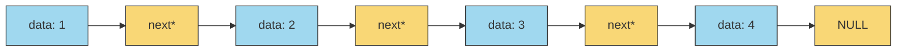

Linked List is one of the fundamental data structures. The key difference between a list and an array is that an array stores data in continuous memory locations whereas a Linked list stores data in random memory location where each node has a pointer towards the next node in the sequence. Hence we can conclude that a list is fundamentally a collection of Nodes. A node is a structure or an object that consists of the data to be stored and 1 or more pointers depending on the type of linked list.



In case of a singly linked list:
```cpp
template <typename T>
struct Node {
	T* data;
	Node* next
	
	Node(T data = T()) : data(data), next(nullptr) {}
};
```
In case of a doubly linked list:
```cpp
template <typename T>
struct Node {
	T* data;
	Node* next
	Node* prev
	
	Node(T data = T()) : data(data), next(nullptr), prev(nullptr) {}
};
```

A singly linked list class is written as follows:
```cpp
template <typename T>
class LinkedList {
	Node<T>* head;
	
public:
	LinkedList() : head(new Node<T>()) {}
	LinkedList(T data) : head(new Node<T>(data)) {}
	
	// Insert, remove, print, search funcs
};
```

Some of the functions of a linked list are as follows:
- Constructors
- isEmpty()
- insert()
- remove()
- print()
- find()
And many more

