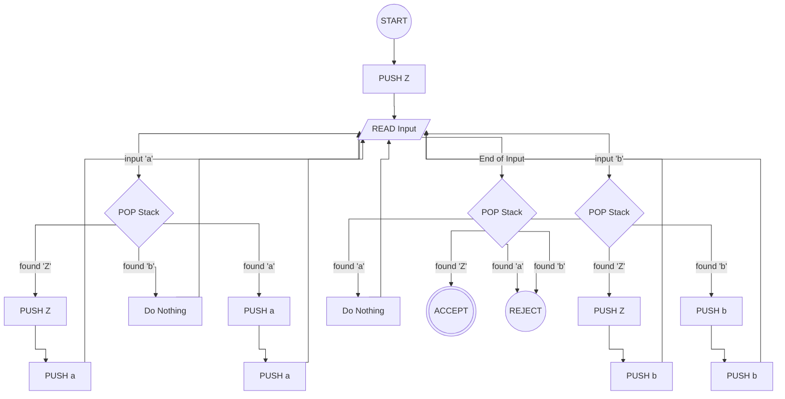

```mermaid
%%{init: {"flowchart": {"curve": "stepAfter"}}}%%
flowchart TD
    %% --- SHAPES ---
    %% Start/End: Round
    %% READ: Parallelogram
    %% POP: Diamond (Decision)
    %% PUSH: Rectangle (Action)

    Start((START)) --> InitPush[PUSH Z]
    InitPush --> ReadState[/READ Input/]

    %% --- THE MAIN LOOP ---
    
    %% Branch 1: Input is 'a'
    ReadState -- input 'a' --> PopCheckA{POP Stack}
    
    PopCheckA -- found 'Z' --> PushAZ[PUSH Z] --> PushA1[PUSH a] --> ReadState
    PopCheckA -- found 'a' --> PushAA[PUSH a] --> PushA2[PUSH a] --> ReadState
    PopCheckA -- found 'b' --> CancelB[Do Nothing] --> ReadState
    %% Explanation: If we pop 'b' and don't push anything back, we effectively cancelled them out.

    %% Branch 2: Input is 'b'
    ReadState -- input 'b' --> PopCheckB{POP Stack}

    PopCheckB -- found 'Z' --> PushBZ[PUSH Z] --> PushB1[PUSH b] --> ReadState
    PopCheckB -- found 'b' --> PushBB[PUSH b] --> PushB2[PUSH b] --> ReadState
    PopCheckB -- found 'a' --> CancelA[Do Nothing] --> ReadState
    %% Explanation: If we pop 'a' and don't push anything back, we cancelled them out.

    %% Branch 3: End of Input
    ReadState -- End of Input --> FinalCheck{POP Stack}

    FinalCheck -- found 'Z' --> Accept(((ACCEPT)))
    FinalCheck -- found 'a' --> Reject((REJECT))
    FinalCheck -- found 'b' --> Reject
```

