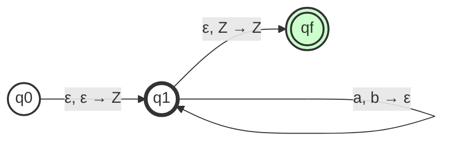

```mermaid
graph LR
    %% Node Definitions
    q0((q0))
    q1((q1))
    qf(((qf)))

    %% Start Transition
    %% Push bottom marker Z
    q0 -- "ε, ε → Z" --> q1

    %% Main Loop Logic (State q1)

    %% Case 1: Stack is Empty (Only Z remains)
    %% Start counting whichever character comes first
    q1 -- "a, Z → aZ" --> q1
    q1 -- "b, Z → bZ" --> q1

    %% Case 2: Match! (Increase Surplus)
    %% Input matches stack top -> Push onto stack
    q1 -- "a, a → aa" --> q1
    q1 -- "b, b → bb" --> q1

    %% Case 3: Clash! (Cancel Out)
    %% Input is opposite to stack top -> Pop from stack
    q1 -- "b, a → ε" --> q1
    q1 -- "a, b → ε" --> q1

    %% Acceptance Transition
    %% If stack is empty (back to Z) and input is done
    q1 -- "ε, Z → Z" --> qf

    %% Styling
    style q0 fill:#fff,stroke:#333,stroke-width:2px
    style q1 fill:#fff,stroke:#333,stroke-width:4px
    style qf fill:#cfc,stroke:#333,stroke-width:2px
```
